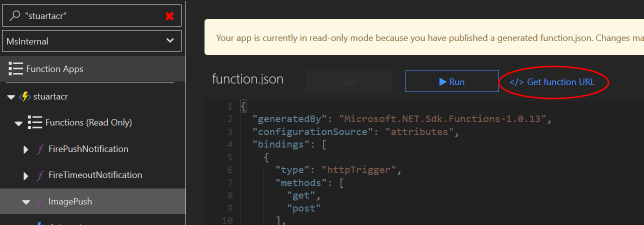

# Azure Container Registry Global Webhook
This repo contains a sample for using Azure Durable Functions to create global webhooks for Azure Container Registry

At the time of creation, Durable Functions only fully supports C# so this project uses C#. Other language support is expected for Durable Functions soon.

The code in the repo is a Durable Functions project that will respond to the webhooks from each replicated region for your Azure Container Registry and combine them into a single global webhook for the registry once all regions have replicated. To demonstrate the power of Durable Functions, the code also shows how you would implement a time-out notification in the event that not all of the regional notifications are received.

## Deployment/Configuration

### Deploy Azure Container Registry (ACR)
Deploy an [Azure Container Registry](https://docs.microsoft.com/en-gb/azure/container-registry/) and [configure geo-replication](https://docs.microsoft.com/en-gb/azure/container-registry/container-registry-tutorial-prepare-registry#configure-geo-replication) to the desired regions.

### Publish the Function App
To explore, clone this repo, build in Visual Studio and [publish to Azure Functions](https://docs.microsoft.com/en-gb/azure/azure-functions/functions-develop-vs#publish-to-azure). Alternatively, set up a [deployment pipeline](https://docs.microsoft.com/en-gb/azure/azure-functions/functions-continuous-deployment)

Set the following [Application Settings](https://docs.microsoft.com/en-gb/azure/azure-functions/functions-how-to-use-azure-function-app-settings#settings) for your Function

Name|Value
- | -
WebhookRegions|A comma-separated list of regions that you have configured registry replication to, e.g. northeurope,westus
WebhookTimeout|The duration before the timeout notification is fired, e.g. 0:1:20 for 1 minute 20 seconds

### Configure the ACR webhooks

Before configuring the webhooks for ACR, go to the Function App in the portal, select the ImagePush function and click 'Copy Function Url' to get the base URL to use for the ACR webhooks

Your base url will be something like `https://yoursite.azurewebsites.net/api/ImagePush?code=YourCodeGoesHere==`. For each region that you are replicating your registry to, [create a webhook](https://docs.microsoft.com/en-gb/azure/container-registry/container-registry-webhook).  To enable the Function to track the notifications for each region, append a `region` querystring parameter to the webhook url for the region that the webhook is attached to. The values for these should match the values used in the `WebhookRegions` setting for the Function, e.g. https://yoursite.azurewebsites.net/api/ImagePush?code=YourCodeGoesHere==&region=northeurope

### Push an image

Once you have deployed and configured the registry and Durable Function it is time to [push an image](https://docs.microsoft.com/en-gb/azure/container-registry/container-registry-webhook)!

You can check on function execution in the [monitor tab](https://docs.microsoft.com/en-gb/azure/azure-functions/functions-monitoring#view-telemetry-in-monitor-tab) in the portal. If everything is configured correctly then you will see the ImagePush function executed once for each registry webhook notification, and the FirePushNotification fired once all the replication notifications are processed. The monitor tab also lets you see logs for the function execution in case of errors.
